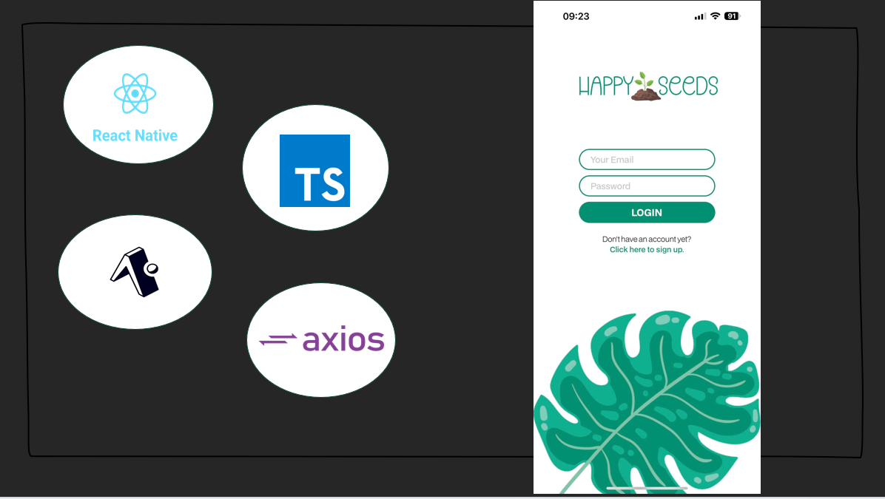

# HAPPY SEEDS

## Intro

Happy Seeds is the final project from a group of 5 Northcoders students. Collectively we are called 'The Buggy-Bears'. This App allows gardening enthusiasts and novices alike to learn more about the plants that they would like/already grow. Happy Seeds uses a combination of React Native and expo for the front end as well as using Firebase and several other API's within the backend. Happy seeds allows you to use smart AI recognition in order to find out what species a plant is. If you like the look of it you can add it to your collection. It allows you to look at how to care for your plant and even offers a calender with daily tasks based on the plant selected.

## Front-End

For our front end we used a combination of:

- React Native
- Typescript
- Expo
- Axios

1. During our research phase we looked at many different types of software to create the front end portion of Happy Seeds. We came to the conclusion that React Native along with Typescript was our best option as it is prominantly used for mobile apps so we saw this as the best fit. We each had to familiarise ourselves with the software as we had previously learnt React and Javascript. React Native had a plethora of built in features that we could use for our app, such as the Calender, Pressable Buttons and states which we could create and pass down as props.

2. We decided to use Expo along side this as it allowed us to use the Expo Go mobile app. This basically allowed us to make sure that our functionality and the styling was acting as it should as it's a different scale on the web app. Expo also allowed us to use features that we may not necessarily have been able to use such as camera permissions, icons and fonts.

3. Axios was also used to make requests to our backend portion of the app which allowed us to use the data from the various databases and api's which were used.
